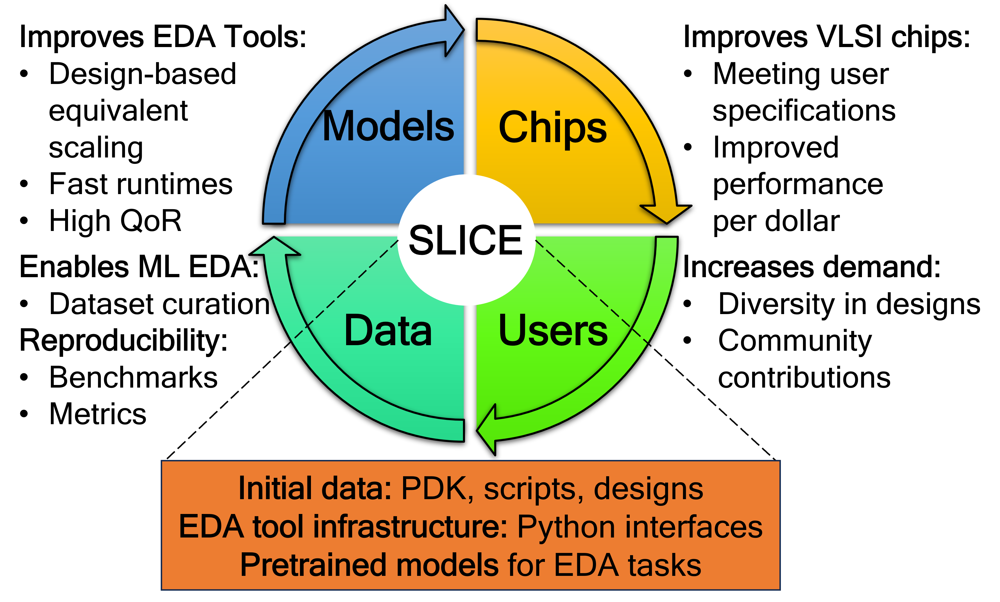
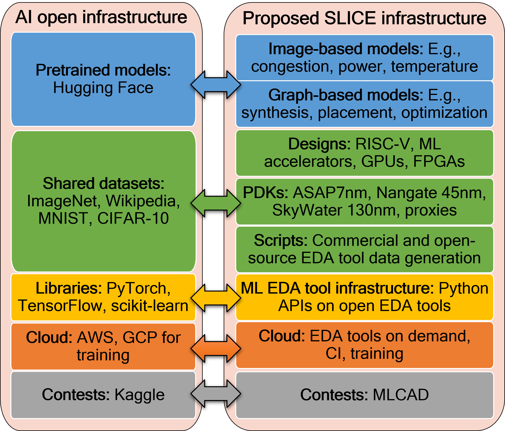

# SLICE

## A Shared Machine Learning Infrastructure for the EDA Community

The SLICE project aims to overcome the barriers to applying machine learning (ML) techniques to electronic design automation (EDA) and chip design problems by building a shareable and extensible infrastructure containing unified design environments, software interfaces between EDA tools and ML platforms, labeled datasets, and pre-trained ML models. Motivated by the spectacular success of the flywheel effect of infrastructure in the broader AI, SLICE aims to create a similar effect for the ML EDA flywheel (shown in figure) by establishing an open infrastructure. 

<figure>
    
    <figcaption>ML EDA Flywheel</figcaption>
</figure>

The infrastructure takes inspiration from the available infrastructure of the ML/AI community. The broader AI community, which is free of these bottlenecks, has a tradition of open and shared infrastructure: “papers with code”, dataset repositories such as Kaggle and OpenML, model libraries (PyTorch, TensorFlow), and pretrained model repositories such as Hugging Face. As shown in figure, the proposed SLICE  project aims to remove the barriers and build an analogous infrastructure for the ML EDA community that will help advance research rapidly. 

## SLICE Contents

SLICE serves as a one-stop shop and has sourced together several existing efforts for benchmarking, dataset collection, tutorials, and has incorporated into its GitHub repostories as a part of SLICE-ML-EDA organization.
 
- [Datasets](https://slice-ml-eda.github.io/docs/datasets.html)
- [EDA Tool Flows](https://slice-ml-eda.github.io/docs/eda_tool_flows.html)
- [Tutorials](https://slice-ml-eda.github.io/docs/tutorials.html)
- [Contests](https://slice-ml-eda.github.io/docs/contests.html)
- [Open-source PDKs](https://slice-ml-eda.github.io/docs/openpdks.html)

## How to contribute?

If you have a pointer to a repository for an ML EDA repository that you think is relevant, create a pull request, or file a issue with the pointer to the SLICE website [GitHub repository](https://github.com/SLICE-ML-EDA/slice-ml-eda.github.io). 

Minimum requirements: 

* The project is helpful for the ML EDA community and could serve as peice of an infrastructure 
* The project is working and not rusty
* At least one tag line describing the project

